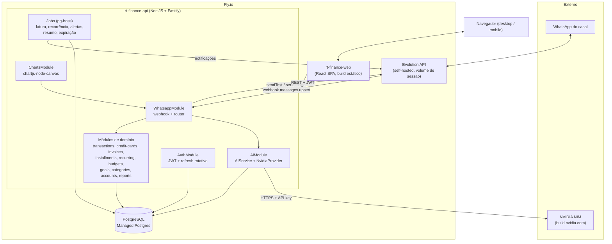
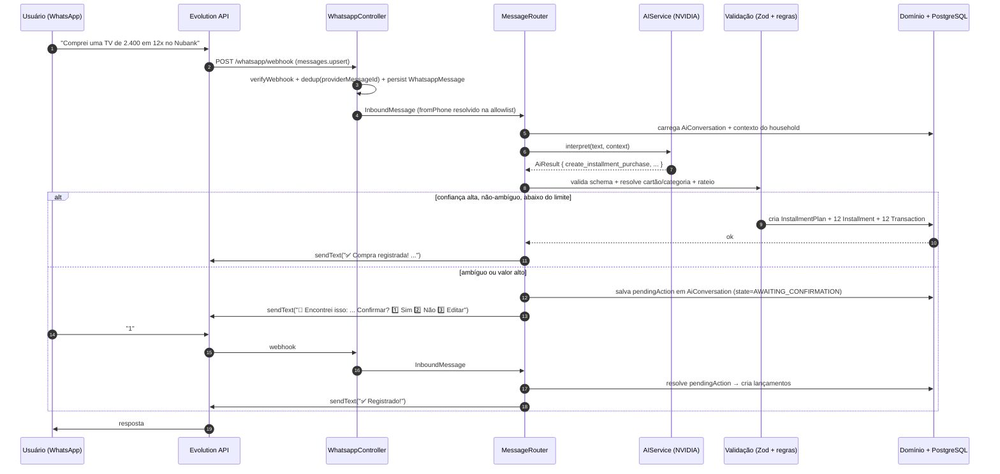

# 01 — Arquitetura

## 1. Visão geral

RT Finance é um sistema de controle financeiro para um casal, com **duas interfaces**
sobre o **mesmo backend e o mesmo banco**:

- **WhatsApp** (interface principal): o usuário escreve mensagens naturais
  ("Gastei 85 no mercado"); uma camada de IA interpreta e o backend registra ou
  responde. Operações ambíguas ou de valor alto passam por confirmação.
- **Painel web** (centro de gestão): dashboards, gráficos interativos, tabelas de
  transações, cadastro de cartões/categorias/recorrências/metas/orçamentos e
  relatórios exportáveis.

Princípios de projeto, em ordem de prioridade (conforme o pedido):
**Segurança → Manutenibilidade → Performance → UX → Simplicidade → Escalabilidade.**

Regra inegociável: **nenhuma mensagem interpretada gera movimentação financeira sem
passar por validação** (schema + regras de negócio) e, quando necessário, confirmação
explícita do usuário.

---

## 2. Diagrama de componentes



---

## 3. Stack e justificativa

| Camada | Escolha | Por quê (resumo — detalhe nos ADRs) |
|---|---|---|
| Monorepo | pnpm workspaces + Turborepo | Tipos e schemas Zod compartilhados entre API, parser de IA e formulários web ([ADR‑0001](06-decisoes-adr.md#adr-0001)) |
| Backend | NestJS + adapter Fastify + TypeScript | Modularidade real, DI, Guards/Interceptors/Filters para auth/validação/erros; caminho para SaaS ([ADR‑0002](06-decisoes-adr.md#adr-0002)) |
| ORM / DB | Prisma + PostgreSQL | Pedido do projeto; migrations versionadas; tipos gerados ([ADR‑0003](06-decisoes-adr.md#adr-0003)) |
| Dinheiro | Inteiro em centavos | Elimina erro de ponto flutuante; rateio de parcelas determinístico ([ADR‑0003](06-decisoes-adr.md#adr-0003)) |
| Tenant | Entidade `Household` desde já | "Conta do casal" no enunciado; habilita SaaS sem reescrever ([ADR‑0004](06-decisoes-adr.md#adr-0004)) |
| IA | `AIService` + `NvidiaProvider` (OpenAI-compatível) | Troca de modelo sem tocar no domínio; saída sempre validada por Zod ([ADR‑0005](06-decisoes-adr.md#adr-0005)) |
| WhatsApp | `WhatsAppService` + Evolution API (self-hosted) | Sem custo, usa o número real, setup rápido; interface troca para Meta Cloud API depois ([ADR‑0006](06-decisoes-adr.md#adr-0006)) |
| Jobs | pg-boss (sobre o Postgres) | Sem Redis; transacional com o banco ([ADR‑0007](06-decisoes-adr.md#adr-0007)) |
| Confirmação | Estado em `AiConversation` (Postgres) | TTL por job de expiração; sem dependência de cache externo ([ADR‑0008](06-decisoes-adr.md#adr-0008)) |
| Frontend | React + Vite + Tailwind + shadcn/ui + Recharts + lucide | Componentes acessíveis (Radix), dark mode por tokens, gráficos interativos ([ADR‑0012](06-decisoes-adr.md#adr-0012)) |
| Gráfico no WhatsApp | chartjs-node-canvas | Render server-side leve; sem headless Chrome ([ADR‑0013](06-decisoes-adr.md#adr-0013)) |
| Deploy | Fly.io (3 apps + Postgres gerenciado) | HTTPS automático para o webhook; volume para a Evolution ([ADR‑0007b](06-decisoes-adr.md#adr-0007b)) |
| Validação | Zod em toda fronteira | env, DTOs, payload do webhook, saída da IA — um só sistema ([ADR‑0002](06-decisoes-adr.md#adr-0002)) |
| Logs | pino + request id | Estruturado; correlação de requisições |
| Testes | Vitest + Supertest/Nest testing + Playwright | Unit ambos os lados, integração da API, 2–3 E2E felizes |

---

## 4. Camadas de abstração

### 4.1 `AIService`

Contrato único para qualquer provedor de LLM. O domínio nunca conhece "NVIDIA".

```ts
// packages/shared/src/ai.ts (contrato) — implementação em apps/api/src/modules/ai
export interface AIService {
  /** Interpreta uma mensagem do usuário no contexto da conversa. */
  interpret(input: {
    text: string;
    context: ConversationContext;      // últimas N trocas + estado + dados do household
  }): Promise<AiResult>;               // union discriminado, validado por Zod

  /** Redige a resposta em linguagem natural a partir de dados já agregados pelo backend. */
  answerQuery(input: {
    question: string;
    template: QueryTemplate;
    data: QueryResultSet;
  }): Promise<string>;

  /** Gera um resumo de período (texto que acompanha um gráfico, por ex.). */
  summarize(input: { period: Period; data: SummaryData }): Promise<string>;
}
```

Implementações previstas: `NvidiaProvider` (agora), `OpenAiProvider`, `GeminiProvider`,
`LocalProvider` (Ollama/vLLM) no futuro. Seleção por `AI_PROVIDER` no `.env`.

`NvidiaProvider` usa o endpoint **OpenAI-compatível** da NVIDIA NIM
(`/chat/completions` com `response_format: json_object` / structured output). Em caso de
JSON malformado: uma tentativa de reparo + re-parse; se ainda falhar, `AiResult` do tipo
`unknown` e o bot pede reformulação. **A chave nunca sai do backend.**

### 4.2 `WhatsAppService`

Contrato único para envio e recepção de mensagens.

```ts
export interface WhatsAppService {
  sendText(to: string, text: string): Promise<{ providerMessageId: string }>;
  sendImage(to: string, png: Buffer, caption?: string): Promise<{ providerMessageId: string }>;
  /** Valida a autenticidade do webhook (token/assinatura do provider). */
  verifyWebhook(req: RawRequest): boolean;
  /** Normaliza o payload bruto do provider para o formato interno. */
  parseInbound(payload: unknown): InboundMessage[];
}
```

Implementação atual: `EvolutionProvider` (REST da Evolution API + evento
`messages.upsert` no webhook). Migração futura para `MetaCloudProvider` só troca esta
classe e a config.

### 4.3 Query templates (consultas da IA)

A IA **não gera SQL**. Ela escolhe um `QueryTemplate` (enum) e parâmetros tipados; o
backend executa agregações Prisma. Exemplos de templates:

| Template | Pergunta típica | Parâmetros |
|---|---|---|
| `SPEND_BY_PERIOD` | "Quanto gastamos esse mês?" | `period`, `memberId?` |
| `SPEND_BY_CATEGORY` | "Quanto gastamos com mercado?" | `period`, `categoryId`, `memberId?` |
| `SPEND_BY_MEMBER` | "Quanto a Julia gastou?" | `period`, `memberId` |
| `REMAINING_BUDGET` | "Quanto ainda temos para gastar?" | `period` |
| `TOP_EXPENSES` | "Quais foram nossas maiores despesas?" | `period`, `limit` |
| `BILLS_DUE` | "Quanto temos de contas para pagar?" | `period` |
| `CARD_INVOICE` | "Quanto está a fatura do Nubank?" | `creditCardId`, `referenceMonth?` |
| `FUTURE_COMMITMENT` | "Quanto já estou comprometido nos próximos meses?" | `months` |
| `MONTHLY_SUMMARY` | "Me mostra o resumo de setembro" | `period` |

Isso elimina SQL injection e alucinação de query, e mantém as respostas auditáveis.

---

## 5. Módulos do backend (responsabilidades)

| Módulo | Responsabilidade |
|---|---|
| `auth` | Login web (email+senha), emissão de access token, refresh rotativo com detecção de reuso, logout (revoga `Session`), guard `JwtAuthGuard`, decorator `@CurrentUser()` |
| `households` | CRUD do household, membros (`HouseholdMember`), papéis, escopo de tenant (guard/interceptor que injeta `householdId` em toda query) |
| `users` | Perfil, telefone E.164, cor de avatar, preferências pessoais |
| `categories` | CRUD de categorias personalizáveis (nome, emoji, cor, tipo, subcategorias); resolução fuzzy de nome vindo da IA |
| `accounts` | Contas de saldo (corrente, poupança, dinheiro, carteira); cálculo de saldo |
| `transactions` | Núcleo do razão: criar/editar/excluir/duplicar/filtrar; regras (valor > 0, exatamente um meio de pagamento); origem (`MANUAL`/`WHATSAPP`/`RECURRING`/`IMPORT`); transferências como par de linhas |
| `credit-cards` | CRUD de cartões; limite total/utilizado/disponível |
| `invoices` | `CreditCardInvoice` por cartão/mês; competência determinística; fechamento; pagamento |
| `installments` | `InstallmentPlan` + `Installment` + geração das `Transaction` das parcelas; rateio com regra de resto; "comprometimento futuro" |
| `recurring-expenses` | Contas fixas; frequência/intervalo; geração de lançamentos futuros; `RecurringRun` anti-duplicação |
| `budgets` | Limite mensal por categoria (opcionalmente por membro); percentual utilizado; disparo de alertas |
| `goals` | Metas (`FinancialGoal`) + aportes (`GoalContribution`); progresso |
| `notifications` | `Notification` + `NotificationPreference`; canais WEB/WHATSAPP; agendamento via jobs |
| `reports` | Agregações para dashboard e relatórios; exportação CSV/XLSX/PDF |
| `whatsapp` | `WhatsappController` (webhook), `WhatsAppService` + providers, `MessageRouter` (orquestra IA → validação → domínio → resposta), formatação das mensagens de saída |
| `ai` | `AIService` + `NvidiaProvider`, prompts, `IntentParser` (Zod), `QueryTemplateResolver`, telemetria `AiInteraction` |
| `charts` | `ChartRendererService` (Chart.js sobre canvas nativo → PNG) para envio pelo WhatsApp |

Módulos transversais em `common/`: `guards/`, `interceptors/` (logging, envelope de
resposta, escopo de tenant), `filters/` (exception filter → envelope de erro),
`pipes/` (validação Zod), `decorators/`.

---

## 6. Fluxo de comunicação (alto nível)



Detalhamento completo (8 fluxos + máquina de estados + contrato `AiResult`) em
[`03-fluxo-whatsapp-ia.md`](03-fluxo-whatsapp-ia.md).

---

## 7. Segurança (resumo — ver [ADR‑0014](06-decisoes-adr.md#adr-0014))

- Senhas com **Argon2id**. JWT access curto (15 min) + **refresh rotativo** com
  detecção de reuso, hash em `Session`; cookie `httpOnly` `SameSite=Lax` no web.
- `Helmet`, CORS por allowlist, `@nestjs/throttler` (rate limit global + estrito em
  `auth` e no webhook).
- Webhook: verificação de token/assinatura do provider + **allowlist dos 2 telefones**
  + idempotência por `providerMessageId`.
- **Zod em toda fronteira**: env (na inicialização), DTOs, payload do webhook, saída
  da IA. Prisma parametriza tudo → sem SQL injection; **IA nunca emite SQL**.
- Segredos só no backend (`NVIDIA_API_KEY`, `EVOLUTION_API_KEY`, `JWT_*`). O frontend
  recebe apenas `VITE_API_URL`.
- `AuditLog` para create/update/delete em entidades de dinheiro. `pg_dump` agendado.
- Exception filter global → envelope de erro normalizado; nenhum stack trace vaza.

---

## 8. Não-objetivos da ETAPA 1

- Nenhum código de aplicação, `package.json`, migration ou seed é criado agora.
- Escolha do modelo NVIDIA específico, forma de servir o frontend e separação do
  worker de jobs ficam para as ETAPAS 5, 3 e 6 respectivamente.
