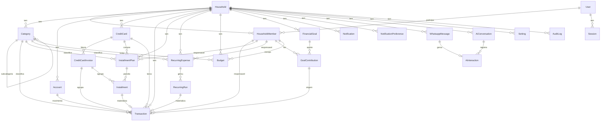

# 02 — Banco de dados

PostgreSQL + Prisma. Este documento traz o **schema proposto** (comentado), o
**diagrama ER**, e as **regras de negócio** que o schema não expressa sozinho
(arredondamento de dinheiro, competência de fatura, escopo multi-tenant).

> Na ETAPA 2 este schema vira `apps/api/prisma/schema.prisma` + a primeira migration
> + o seed. Aqui ele é apenas a modelagem para revisão.

---

## 1. Convenções

| Assunto | Regra |
|---|---|
| Dinheiro | Sempre `Int` em **centavos** (`amountCents`, `limitCents`, ...). Nunca `Float`/`Decimal`. |
| Datas de competência | `DateTime @db.Date` (sem hora). Ex.: `Transaction.date`, `Installment.dueDate`, `Budget.month`. |
| Timestamps | `DateTime @db.Timestamptz(6)` em UTC (`createdAt`, `updatedAt`). |
| Fuso de negócio | Todo "mês", fechamento de fatura e vencimento é calculado em `America/Sao_Paulo` na aplicação. |
| IDs | `String @id @default(cuid())`. |
| Multi-tenant | Toda entidade financeira tem `householdId`. Um interceptor injeta o filtro `householdId` em toda leitura; nenhuma query cross-household. |
| Exclusão | FKs financeiras com `onDelete: Restrict`. "Excluir" cartão/categoria = `archivedAt` (soft delete) quando há histórico. |
| Enums | Declarados em Postgres via Prisma `enum`. |

---

## 2. Diagrama ER



---

## 3. Schema Prisma (proposto)

```prisma
// ---------------------------------------------------------------------------
// RT Finance — schema.prisma (proposta ETAPA 1)
// ---------------------------------------------------------------------------
generator client {
  provider = "prisma-client-js"
}

datasource db {
  provider = "postgresql"
  url      = env("DATABASE_URL")
}

// ===================== ENUMS =====================
enum MemberRole            { OWNER MEMBER }
enum TransactionType       { EXPENSE INCOME TRANSFER }
enum TransactionStatus     { PENDING CONFIRMED CLEARED CANCELED }
enum TransactionSource     { MANUAL WHATSAPP RECURRING IMPORT }
enum CategoryKind          { EXPENSE INCOME BOTH }
enum AccountType           { CHECKING SAVINGS CASH WALLET }
enum CardStatus            { ACTIVE INACTIVE }
enum InvoiceStatus         { OPEN CLOSED PAID OVERDUE }
enum InstallmentStatus     { SCHEDULED BILLED PAID CANCELED }
enum RecurrenceFrequency   { WEEKLY MONTHLY YEARLY }
enum GoalStatus            { ACTIVE ACHIEVED ARCHIVED }
enum NotificationType      { INVOICE_DUE BILL_DUE BUDGET_THRESHOLD BUDGET_EXCEEDED GOAL_MILESTONE WEEKLY_SUMMARY }
enum NotificationChannel   { WEB WHATSAPP BOTH }
enum NotificationStatus    { PENDING SENT READ DISMISSED }
enum MessageDirection      { INBOUND OUTBOUND }
enum MessageType           { TEXT IMAGE AUDIO DOCUMENT INTERACTIVE OTHER }
enum AiConversationState   { IDLE AWAITING_CONFIRMATION AWAITING_EDIT }
enum AiChannel             { WHATSAPP WEB }

// ===================== TENANT / USUÁRIOS =====================
model Household {
  id        String   @id @default(cuid())
  name      String
  timezone  String   @default("America/Sao_Paulo")
  currency  String   @default("BRL")
  createdAt DateTime @default(now()) @db.Timestamptz(6)
  updatedAt DateTime @updatedAt @db.Timestamptz(6)

  members            HouseholdMember[]
  categories         Category[]
  accounts           Account[]
  creditCards        CreditCard[]
  transactions       Transaction[]
  installmentPlans   InstallmentPlan[]
  recurringExpenses  RecurringExpense[]
  budgets            Budget[]
  goals              FinancialGoal[]
  notifications      Notification[]
  notifPreferences   NotificationPreference[]
  whatsappMessages   WhatsappMessage[]
  aiConversations    AiConversation[]
  settings           Setting[]
  auditLogs          AuditLog[]
}

model User {
  id           String   @id @default(cuid())
  name         String
  email        String   @unique
  passwordHash String
  phoneE164    String?  @unique          // usado para identificar no WhatsApp
  avatarColor  String   @default("#3B82F6")
  createdAt    DateTime @default(now()) @db.Timestamptz(6)
  updatedAt    DateTime @updatedAt @db.Timestamptz(6)

  memberships HouseholdMember[]
  sessions    Session[]
}

model HouseholdMember {
  id          String     @id @default(cuid())
  householdId String
  userId      String
  role        MemberRole @default(MEMBER)
  displayName String                       // "Filipe", "Julia" — aparece nos lançamentos
  color       String     @default("#3B82F6")
  joinedAt    DateTime   @default(now()) @db.Timestamptz(6)

  household          Household          @relation(fields: [householdId], references: [id], onDelete: Cascade)
  user              User               @relation(fields: [userId], references: [id], onDelete: Cascade)
  transactions      Transaction[]      @relation("TxMember")
  createdTx         Transaction[]      @relation("TxCreatedBy")
  installmentPlans  InstallmentPlan[]
  recurringExpenses RecurringExpense[]
  goalContributions GoalContribution[]
  budgets           Budget[]
  aiConversations   AiConversation[]

  @@unique([householdId, userId])
  @@index([householdId])
}

model Session {
  id         String    @id @default(cuid())
  userId     String
  tokenHash  String    @unique            // hash do refresh token
  familyId   String                        // rotação: detecção de reuso por família
  userAgent  String?
  ip         String?
  expiresAt  DateTime  @db.Timestamptz(6)
  revokedAt  DateTime? @db.Timestamptz(6)
  createdAt  DateTime  @default(now()) @db.Timestamptz(6)

  user User @relation(fields: [userId], references: [id], onDelete: Cascade)

  @@index([userId])
  @@index([familyId])
}

// ===================== CATEGORIAS / CONTAS =====================
model Category {
  id          String       @id @default(cuid())
  householdId String
  name        String
  icon        String       @default("📦")  // emoji
  color       String       @default("#64748B")
  kind        CategoryKind @default(EXPENSE)
  parentId    String?
  isSystem    Boolean      @default(false)  // criada pelo seed; não pode ser excluída
  archivedAt  DateTime?    @db.Timestamptz(6)
  createdAt   DateTime     @default(now()) @db.Timestamptz(6)
  updatedAt   DateTime     @updatedAt @db.Timestamptz(6)

  household        Household         @relation(fields: [householdId], references: [id], onDelete: Cascade)
  parent           Category?         @relation("CategoryTree", fields: [parentId], references: [id], onDelete: SetNull)
  children         Category[]        @relation("CategoryTree")
  transactions     Transaction[]
  installmentPlans InstallmentPlan[]
  recurring        RecurringExpense[]
  budgets          Budget[]

  @@unique([householdId, name])
  @@index([householdId, kind])
}

model Account {
  id                 String    @id @default(cuid())
  householdId        String
  name               String
  type               AccountType @default(CHECKING)
  openingBalanceCents Int      @default(0)
  archivedAt         DateTime? @db.Timestamptz(6)
  createdAt          DateTime  @default(now()) @db.Timestamptz(6)
  updatedAt          DateTime  @updatedAt @db.Timestamptz(6)

  household     Household     @relation(fields: [householdId], references: [id], onDelete: Cascade)
  transactions  Transaction[]

  @@unique([householdId, name])
  @@index([householdId])
}

// ===================== CARTÕES / FATURAS =====================
model CreditCard {
  id          String     @id @default(cuid())
  householdId String
  name        String
  bank        String?
  brand       String?                       // VISA, MASTERCARD, ELO...
  last4       String?
  limitCents  Int        @default(0)
  closingDay  Int                            // 1..31
  dueDay      Int                            // 1..31
  color       String     @default("#8B5CF6")
  icon        String     @default("💳")
  status      CardStatus @default(ACTIVE)
  createdAt   DateTime   @default(now()) @db.Timestamptz(6)
  updatedAt   DateTime   @updatedAt @db.Timestamptz(6)

  household         Household           @relation(fields: [householdId], references: [id], onDelete: Cascade)
  invoices         CreditCardInvoice[]
  installmentPlans InstallmentPlan[]
  transactions     Transaction[]

  @@unique([householdId, name])
  @@index([householdId, status])
}

model CreditCardInvoice {
  id             String        @id @default(cuid())
  creditCardId   String
  referenceMonth DateTime      @db.Date       // 1º dia do mês de competência
  closingDate    DateTime      @db.Date
  dueDate        DateTime      @db.Date
  status         InvoiceStatus @default(OPEN)
  totalCents     Int           @default(0)    // cache, recalculado no fechamento
  paidAt         DateTime?     @db.Timestamptz(6)
  paymentTransactionId String?  @unique
  createdAt      DateTime      @default(now()) @db.Timestamptz(6)
  updatedAt      DateTime      @updatedAt @db.Timestamptz(6)

  creditCard         CreditCard   @relation(fields: [creditCardId], references: [id], onDelete: Cascade)
  paymentTransaction Transaction? @relation("InvoicePayment", fields: [paymentTransactionId], references: [id])
  transactions       Transaction[] @relation("InvoiceItems")
  installments       Installment[]

  @@unique([creditCardId, referenceMonth])
  @@index([creditCardId, status])
  @@index([dueDate])
}

// ===================== RAZÃO (CORE) =====================
model Transaction {
  id           String            @id @default(cuid())
  householdId  String
  type         TransactionType
  amountCents  Int                                // sempre > 0 (regra no service)
  description  String
  date         DateTime          @db.Date         // competência
  status       TransactionStatus @default(CONFIRMED)
  source       TransactionSource @default(MANUAL)
  notes        String?
  externalRef  String?                            // id externo em imports
  transferGroupId String?                         // par de linhas em TRANSFER

  categoryId   String?
  accountId    String?                            // meio de pagamento (débito/dinheiro)
  creditCardId String?                            // meio de pagamento (crédito)
  invoiceId    String?                            // fatura em que caiu
  installmentId String? @unique                   // se é a materialização de uma parcela
  recurringExpenseId String?                      // se veio de recorrência
  memberId     String                             // responsável
  createdById  String                             // quem lançou

  createdAt    DateTime @default(now()) @db.Timestamptz(6)
  updatedAt    DateTime @updatedAt @db.Timestamptz(6)

  household        Household          @relation(fields: [householdId], references: [id], onDelete: Cascade)
  category         Category?          @relation(fields: [categoryId], references: [id], onDelete: SetNull)
  account          Account?           @relation(fields: [accountId], references: [id], onDelete: Restrict)
  creditCard       CreditCard?        @relation(fields: [creditCardId], references: [id], onDelete: Restrict)
  invoice          CreditCardInvoice? @relation("InvoiceItems", fields: [invoiceId], references: [id], onDelete: SetNull)
  invoicePaymentOf CreditCardInvoice? @relation("InvoicePayment")
  installment      Installment?       @relation(fields: [installmentId], references: [id], onDelete: SetNull)
  recurringExpense RecurringExpense?  @relation(fields: [recurringExpenseId], references: [id], onDelete: SetNull)
  member           HouseholdMember    @relation("TxMember", fields: [memberId], references: [id], onDelete: Restrict)
  createdBy        HouseholdMember    @relation("TxCreatedBy", fields: [createdById], references: [id], onDelete: Restrict)
  recurringRun     RecurringRun?
  goalContribution GoalContribution?

  @@index([householdId, date])
  @@index([householdId, categoryId, date])
  @@index([householdId, memberId, date])
  @@index([creditCardId, date])
  @@index([invoiceId])
  @@index([transferGroupId])
}

// ===================== PARCELAMENTOS =====================
model InstallmentPlan {
  id               String   @id @default(cuid())
  householdId      String
  creditCardId     String
  categoryId       String?
  memberId         String
  description      String
  totalCents       Int
  installmentCount Int
  purchaseDate     DateTime @db.Date
  firstDueDate     DateTime @db.Date
  createdAt        DateTime @default(now()) @db.Timestamptz(6)
  updatedAt        DateTime @updatedAt @db.Timestamptz(6)

  household   Household       @relation(fields: [householdId], references: [id], onDelete: Cascade)
  creditCard  CreditCard      @relation(fields: [creditCardId], references: [id], onDelete: Restrict)
  category    Category?       @relation(fields: [categoryId], references: [id], onDelete: SetNull)
  member      HouseholdMember @relation(fields: [memberId], references: [id], onDelete: Restrict)
  installments Installment[]

  @@index([householdId])
  @@index([creditCardId])
}

model Installment {
  id            String            @id @default(cuid())
  planId        String
  number        Int                                // 1..installmentCount
  amountCents   Int                                // soma = plan.totalCents (regra de resto)
  dueDate       DateTime          @db.Date
  status        InstallmentStatus @default(SCHEDULED)
  invoiceId     String?
  transactionId String?           @unique
  createdAt     DateTime @default(now()) @db.Timestamptz(6)
  updatedAt     DateTime @updatedAt @db.Timestamptz(6)

  plan        InstallmentPlan    @relation(fields: [planId], references: [id], onDelete: Cascade)
  invoice     CreditCardInvoice? @relation(fields: [invoiceId], references: [id], onDelete: SetNull)
  transaction Transaction?

  @@unique([planId, number])
  @@index([dueDate])
  @@index([invoiceId])
}

// ===================== CONTAS FIXAS / RECORRÊNCIAS =====================
model RecurringExpense {
  id                String              @id @default(cuid())
  householdId       String
  categoryId        String
  memberId          String
  name              String
  amountCents       Int?                              // null = valor variável (pede confirmação a cada geração)
  frequency         RecurrenceFrequency @default(MONTHLY)
  interval          Int                 @default(1)   // a cada N períodos
  dayOfMonth        Int?                              // p/ MONTHLY/YEARLY
  weekday           Int?                              // p/ WEEKLY (0..6)
  autoPost          Boolean             @default(true) // true = gera CONFIRMED; false = PENDING
  accountId         String?
  creditCardId      String?
  startDate         DateTime            @db.Date
  endDate           DateTime?           @db.Date
  lastGeneratedDate DateTime?           @db.Date
  active            Boolean             @default(true)
  createdAt         DateTime @default(now()) @db.Timestamptz(6)
  updatedAt         DateTime @updatedAt @db.Timestamptz(6)

  household   Household        @relation(fields: [householdId], references: [id], onDelete: Cascade)
  category    Category         @relation(fields: [categoryId], references: [id], onDelete: Restrict)
  member      HouseholdMember  @relation(fields: [memberId], references: [id], onDelete: Restrict)
  runs        RecurringRun[]
  transactions Transaction[]

  @@index([householdId, active])
}

model RecurringRun {
  id                 String   @id @default(cuid())
  recurringExpenseId String
  period             DateTime @db.Date            // 1º dia do período gerado
  transactionId      String?  @unique
  createdAt          DateTime @default(now()) @db.Timestamptz(6)

  recurringExpense RecurringExpense @relation(fields: [recurringExpenseId], references: [id], onDelete: Cascade)
  transaction      Transaction?     @relation(fields: [transactionId], references: [id], onDelete: SetNull)

  @@unique([recurringExpenseId, period])          // anti-duplicação
}

// ===================== ORÇAMENTOS =====================
model Budget {
  id          String   @id @default(cuid())
  householdId String
  categoryId  String
  memberId    String?                             // null = orçamento do casal
  month       DateTime @db.Date                    // 1º dia do mês
  amountCents Int
  rollover    Boolean  @default(false)
  createdAt   DateTime @default(now()) @db.Timestamptz(6)
  updatedAt   DateTime @updatedAt @db.Timestamptz(6)

  household Household         @relation(fields: [householdId], references: [id], onDelete: Cascade)
  category  Category          @relation(fields: [categoryId], references: [id], onDelete: Cascade)
  member    HouseholdMember?  @relation(fields: [memberId], references: [id], onDelete: Cascade)

  @@unique([householdId, categoryId, month, memberId])
  @@index([householdId, month])
}

// ===================== METAS =====================
model FinancialGoal {
  id          String     @id @default(cuid())
  householdId String
  name        String
  targetCents Int
  currentCents Int       @default(0)               // cache = soma dos aportes
  deadline    DateTime?  @db.Date
  icon        String     @default("🎯")
  color       String     @default("#10B981")
  status      GoalStatus @default(ACTIVE)
  createdAt   DateTime @default(now()) @db.Timestamptz(6)
  updatedAt   DateTime @updatedAt @db.Timestamptz(6)

  household     Household          @relation(fields: [householdId], references: [id], onDelete: Cascade)
  contributions GoalContribution[]

  @@index([householdId, status])
}

model GoalContribution {
  id            String   @id @default(cuid())
  goalId        String
  memberId      String
  amountCents   Int
  date          DateTime @db.Date
  note          String?
  transactionId String?  @unique
  createdAt     DateTime @default(now()) @db.Timestamptz(6)

  goal        FinancialGoal   @relation(fields: [goalId], references: [id], onDelete: Cascade)
  member      HouseholdMember @relation(fields: [memberId], references: [id], onDelete: Restrict)
  transaction Transaction?    @relation(fields: [transactionId], references: [id], onDelete: SetNull)

  @@index([goalId])
}

// ===================== NOTIFICAÇÕES =====================
model Notification {
  id          String             @id @default(cuid())
  householdId String
  userId      String?                              // null = todos os membros
  type        NotificationType
  title       String
  body        String
  data        Json?
  channel     NotificationChannel @default(BOTH)
  status      NotificationStatus  @default(PENDING)
  scheduledFor DateTime?          @db.Timestamptz(6)
  sentAt      DateTime?           @db.Timestamptz(6)
  createdAt   DateTime @default(now()) @db.Timestamptz(6)

  household Household @relation(fields: [householdId], references: [id], onDelete: Cascade)

  @@index([householdId, status])
  @@index([scheduledFor])
}

model NotificationPreference {
  id               String              @id @default(cuid())
  householdId      String
  type             NotificationType
  enabled          Boolean             @default(true)
  channelWeb       Boolean             @default(true)
  channelWhatsapp  Boolean             @default(true)
  thresholdPercent Int?                                // p/ BUDGET_THRESHOLD (ex.: 80)
  leadDays         Int?                                // p/ *_DUE (ex.: 2 = avisa 2 dias antes)

  household Household @relation(fields: [householdId], references: [id], onDelete: Cascade)

  @@unique([householdId, type])
}

// ===================== WHATSAPP / IA =====================
model WhatsappMessage {
  id                String           @id @default(cuid())
  householdId       String?                            // null até resolver o remetente
  userId            String?
  providerMessageId String           @unique            // idempotência
  direction         MessageDirection
  fromPhone         String
  toPhone           String
  type              MessageType      @default(TEXT)
  text              String?
  mediaUrl          String?
  rawPayload        Json
  status            String?                            // sent/delivered/read/failed
  createdAt         DateTime @default(now()) @db.Timestamptz(6)

  household    Household?     @relation(fields: [householdId], references: [id], onDelete: SetNull)
  aiInteraction AiInteraction?

  @@index([householdId, createdAt])
  @@index([fromPhone, createdAt])
}

model AiConversation {
  id             String              @id @default(cuid())
  householdId    String
  memberId       String
  channel        AiChannel           @default(WHATSAPP)
  state          AiConversationState @default(IDLE)
  lastIntent     String?
  pendingAction  Json?                                  // rascunho aguardando confirmação
  pendingExpiresAt DateTime?         @db.Timestamptz(6)
  updatedAt      DateTime @updatedAt @db.Timestamptz(6)
  createdAt      DateTime @default(now()) @db.Timestamptz(6)

  household     Household        @relation(fields: [householdId], references: [id], onDelete: Cascade)
  member       HouseholdMember  @relation(fields: [memberId], references: [id], onDelete: Cascade)
  interactions AiInteraction[]

  @@unique([memberId, channel])                         // 1 conversa ativa por membro/canal
  @@index([state, pendingExpiresAt])
}

model AiInteraction {
  id               String   @id @default(cuid())
  conversationId   String
  messageId        String?  @unique
  provider         String                               // "nvidia"
  model            String
  promptTokens     Int?
  completionTokens Int?
  latencyMs        Int?
  intent           String?
  confidence       Float?
  rawResponse      Json?
  createdAt        DateTime @default(now()) @db.Timestamptz(6)

  conversation AiConversation   @relation(fields: [conversationId], references: [id], onDelete: Cascade)
  message      WhatsappMessage? @relation(fields: [messageId], references: [id], onDelete: SetNull)

  @@index([conversationId, createdAt])
}

// ===================== CONFIG / AUDITORIA =====================
model Setting {
  id          String @id @default(cuid())
  householdId String
  key         String
  value       Json
  updatedAt   DateTime @updatedAt @db.Timestamptz(6)

  household Household @relation(fields: [householdId], references: [id], onDelete: Cascade)

  @@unique([householdId, key])
}

model AuditLog {
  id          String   @id @default(cuid())
  householdId String
  actorUserId String?
  action      String                                   // CREATE | UPDATE | DELETE
  entity      String                                   // "Transaction", "CreditCard"...
  entityId    String
  before      Json?
  after       Json?
  createdAt   DateTime @default(now()) @db.Timestamptz(6)

  household Household @relation(fields: [householdId], references: [id], onDelete: Cascade)

  @@index([householdId, createdAt])
  @@index([entity, entityId])
}
```

---

## 4. Regras de negócio que o schema não expressa

### 4.1 Valor e meio de pagamento (`Transaction`)

- `amountCents > 0` **sempre** (o sinal é dado por `type`).
- Para `EXPENSE`/`INCOME`: **exatamente um** de (`accountId`, `creditCardId`).
- Para `TRANSFER`: cria-se **um par** de linhas com o mesmo `transferGroupId`
  (uma `EXPENSE` na conta de origem, uma `INCOME` na de destino), fora de categorias
  de resultado.
- `date` é a competência (afeta relatórios); `createdAt` é o registro.

### 4.2 Arredondamento de parcelas (regra de resto)

Dado `totalCents` e `installmentCount = n`:

```
base = floor(totalCents / n)
r    = totalCents - base * n          // 0 <= r < n
parcela[i].amountCents = base + (i <= r ? 1 : 0)   // i = 1..n
```

As **primeiras `r` parcelas** recebem +1 centavo. Garante `Σ parcelas == totalCents`
sem depender de ponto flutuante.

**Exemplo:** R$ 3.600,00 em 12x → `base = 30000`, `r = 0` → 12 × R$ 300,00.
R$ 100,00 em 3x → `base = 3333`, `r = 1` → R$ 33,34 + R$ 33,33 + R$ 33,33.

### 4.3 Competência de fatura (determinística)

Cartão com `closingDay = C`, `dueDay = D`. Transação/parcela com data `X`:

```
dia = day(X)
referenceMonth = (dia <= C) ? firstDayOfMonth(X) : firstDayOfMonth(X) + 1 mês
closingDate    = referenceMonth com dia = C        (clampado ao último dia do mês)
dueDate        = (D > C ? referenceMonth : referenceMonth + 1 mês) com dia = D   (clampado)
```

`CreditCardInvoice` é criada sob demanda e é **única por `(creditCardId, referenceMonth)`**.
`totalCents` é cache: recalculado no job de fechamento (soma das `Transaction` com
aquele `invoiceId`) e ao pagar.

**Exemplo (Nubank, C=10, D=17):** compra em 03/09 → `referenceMonth = 01/09`,
`closingDate = 10/09`, `dueDate = 17/09`. Compra em 12/09 → `referenceMonth = 01/10`,
`closingDate = 10/10`, `dueDate = 17/10`.

### 4.4 Limite do cartão

```
limiteUtilizado = Σ Transaction.amountCents (type=EXPENSE, creditCardId=card,
                     status ∈ {PENDING, CONFIRMED}, invoice.status ≠ PAID)
                  + Σ Installment.amountCents (status ∈ {SCHEDULED, BILLED})
limiteDisponivel = limitCents - limiteUtilizado
```

(A materialização eager das parcelas em `Transaction` — ADR‑0009 — permite calcular
tudo a partir de `Transaction`; `Installment` é a fonte para parcelas ainda não
materializadas em faturas futuras além do horizonte.)

### 4.5 Escopo multi-tenant

- Toda entidade financeira tem `householdId`.
- `TenantInterceptor` lê o `householdId` do usuário autenticado (ou do membro
  resolvido no webhook) e o injeta no `PrismaService` (extensão de query) — nenhuma
  query de leitura roda sem o filtro.
- O casal usa **um único household** com dois `HouseholdMember`. Ambos veem os mesmos
  dados; os lançamentos guardam `memberId` (responsável) para as visões "gastos do
  Filipe / da Julia / do casal".

### 4.6 Geração de recorrências

Job diário: para cada `RecurringExpense` ativa, calcula as ocorrências entre
`lastGeneratedDate` e `hoje + RECURRING_HORIZON_MONTHS`. Para cada `period` sem
`RecurringRun`, cria `Transaction` (`CONFIRMED` se `autoPost`, senão `PENDING`) e a
`RecurringRun` correspondente. `amountCents = null` → cria `PENDING` e dispara pergunta
de valor no WhatsApp.

### 4.7 Orçamento e alertas

No `create`/`update` de `Transaction` e num job diário: para cada `Budget` do mês
corrente, `gasto = Σ EXPENSE da categoria no mês (escopo do memberId, se houver)`.
- `gasto >= thresholdPercent% do amountCents` → `Notification` `BUDGET_THRESHOLD`
  (uma vez por `(budget, mês)`).
- `gasto > amountCents` → `BUDGET_EXCEEDED` (uma vez por `(budget, mês)`).

### 4.8 Metas

`FinancialGoal.currentCents` é cache = `Σ GoalContribution.amountCents`. Ao atingir
25/50/75/100% → `Notification` `GOAL_MILESTONE`. 100% → `status = ACHIEVED`.

---

## 5. Seed inicial (ETAPA 2)

- 1 `Household` ("Casa RT", `America/Sao_Paulo`, BRL).
- 2 `User` + 2 `HouseholdMember` (Filipe = OWNER, Julia = MEMBER) — senhas via `.env`
  de seed, telefones da `WHATSAPP_ALLOWLIST`.
- Categorias-sistema: 🛒 Mercado, 🍔 Alimentação, 🚗 Transporte, 🏠 Casa, 💡 Contas,
  💳 Cartão, 🎮 Lazer, 👕 Roupas, 💊 Saúde, 📱 Assinaturas, 📚 Educação, ✈️ Viagens,
  💰 Salário (INCOME), 📦 Outros.
- `NotificationPreference` padrão para cada `NotificationType` (threshold 80%, leadDays 2).
- Nenhum cartão/conta/transação (o casal cadastra).
