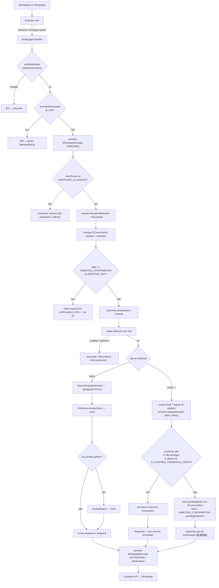
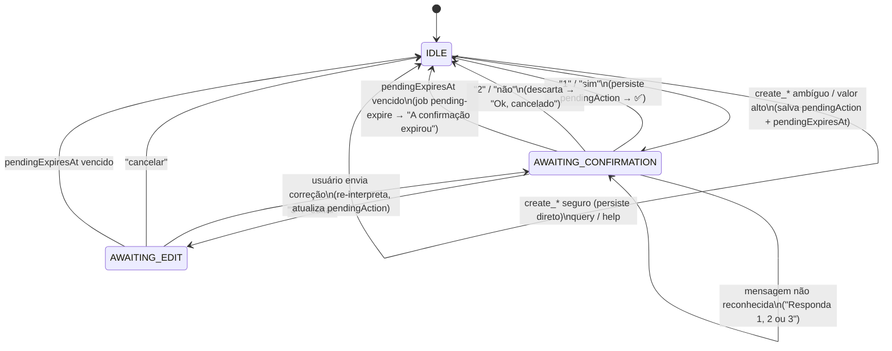

# 03 — Fluxo WhatsApp → IA → Backend → PostgreSQL → WhatsApp

## 1. Pipeline principal



Pontos de segurança do pipeline:

1. **Autenticidade** — `verifyWebhook` (header `WHATSAPP_WEBHOOK_TOKEN` que a Evolution
   envia; se migrar para Meta, HMAC `X-Hub-Signature-256`).
2. **Idempotência** — `providerMessageId` é `@unique`; reentrega não duplica.
3. **Autorização** — allowlist dos 2 telefones; número desconhecido nunca aciona a IA.
4. **Validação** — a saída da IA passa por Zod **e** por regras de negócio antes de
   qualquer escrita.
5. **Confirmação** — criação só persiste direto se **confiança alta + não-ambíguo +
   abaixo do limite de valor**; senão, card `1/2/3`.
6. **Custo/telemetria** — cada chamada de LLM grava `AiInteraction` (tokens, latência,
   intent, confidence).

---

## 2. Contrato `AiResult` (união discriminada, validada por Zod)

Definido em `packages/shared/src/intents.ts` e reusado pelo backend.

```ts
import { z } from "zod";

const Money = z.number().int().positive();            // centavos
const IsoDate = z.string().regex(/^\d{4}-\d{2}-\d{2}$/);

export const DraftExpense = z.object({
  kind: z.literal("create_expense"),
  amountCents: Money,
  description: z.string().min(1),
  categoryHint: z.string().nullable(),                // texto livre; backend resolve p/ categoryId
  date: IsoDate,                                      // default: hoje (America/Sao_Paulo)
  paymentHint: z.string().nullable(),                 // "nubank", "dinheiro", "débito"...
  memberHint: z.string().nullable(),                  // "eu", "julia" — default: remetente
  confidence: z.number().min(0).max(1),
  ambiguous: z.boolean(),
  clarification: z.string().nullable(),               // pergunta a fazer se ambíguo
});

export const DraftIncome = DraftExpense.extend({ kind: z.literal("create_income") });

export const DraftInstallmentPurchase = z.object({
  kind: z.literal("create_installment_purchase"),
  totalCents: Money,
  installmentCount: z.number().int().min(2).max(60),
  description: z.string().min(1),
  categoryHint: z.string().nullable(),
  cardHint: z.string().min(1),                        // obrigatório p/ parcelamento
  firstDueDate: IsoDate.nullable(),                   // null = calcular pela competência
  purchaseDate: IsoDate,
  memberHint: z.string().nullable(),
  confidence: z.number().min(0).max(1),
  ambiguous: z.boolean(),
  clarification: z.string().nullable(),
});

export const DraftRecurring = z.object({
  kind: z.literal("create_recurring"),
  name: z.string().min(1),
  amountCents: Money.nullable(),                      // null = valor variável
  categoryHint: z.string().nullable(),
  frequency: z.enum(["WEEKLY", "MONTHLY", "YEARLY"]),
  dayOfMonth: z.number().int().min(1).max(31).nullable(),
  paymentHint: z.string().nullable(),
  memberHint: z.string().nullable(),
  confidence: z.number().min(0).max(1),
  ambiguous: z.boolean(),
  clarification: z.string().nullable(),
});

export const QueryRequest = z.object({
  kind: z.literal("query"),
  template: z.enum([
    "SPEND_BY_PERIOD", "SPEND_BY_CATEGORY", "SPEND_BY_MEMBER", "REMAINING_BUDGET",
    "TOP_EXPENSES", "BILLS_DUE", "CARD_INVOICE", "FUTURE_COMMITMENT", "MONTHLY_SUMMARY",
  ]),
  params: z.object({
    period: z.enum(["THIS_MONTH", "LAST_MONTH", "THIS_YEAR", "CUSTOM"]).default("THIS_MONTH"),
    from: IsoDate.nullable(),
    to: IsoDate.nullable(),
    categoryHint: z.string().nullable(),
    memberHint: z.string().nullable(),
    cardHint: z.string().nullable(),
    months: z.number().int().min(1).max(24).nullable(),
    limit: z.number().int().min(1).max(20).nullable(),
  }),
  wantsChart: z.boolean(),
  confidence: z.number().min(0).max(1),
});

export const ConfirmationReply = z.object({
  kind: z.literal("confirmation_reply"),
  choice: z.enum(["YES", "NO", "EDIT"]),
  editText: z.string().nullable(),                    // se choice = EDIT
});

export const HelpRequest = z.object({ kind: z.literal("help") });
export const UnknownResult = z.object({
  kind: z.literal("unknown"),
  reason: z.string(),
});

export const AiResult = z.discriminatedUnion("kind", [
  DraftExpense, DraftIncome, DraftInstallmentPurchase, DraftRecurring,
  QueryRequest, ConfirmationReply, HelpRequest, UnknownResult,
]);
export type AiResult = z.infer<typeof AiResult>;
```

> A IA devolve **hints** de texto (`categoryHint`, `cardHint`, `memberHint`,
> `paymentHint`), nunca IDs. O backend faz a resolução (match exato → fuzzy →
> pergunta) contra os dados reais do household. Isso impede a IA de "inventar" um
> cartão ou categoria inexistente.

### 2.1 Resolução de hints (backend)

| Hint | Resolução |
|---|---|
| `categoryHint` | match case-insensitive no `name`; senão similaridade (trigram/`pg_trgm`); se < limiar → categoria `📦 Outros` + flag "revisar" na resposta |
| `cardHint` | match no `name`/`bank`/`last4`; se não resolver e a operação exige cartão → pergunta "Qual cartão? (Nubank, Inter, ...)" |
| `memberHint` | "eu/meu/minha" → remetente; nome → `HouseholdMember.displayName`; ausente → remetente |
| `paymentHint` | "dinheiro/espécie" → `Account` CASH; "débito/conta" → `Account` CHECKING padrão; nome de cartão → `CreditCard`; ausente numa despesa → conta padrão |
| `date` ausente | hoje em `America/Sao_Paulo` |

---

## 3. Máquina de estados da confirmação



- `pendingAction` (JSONB) guarda o **Draft já resolvido** (com `categoryId`, `cardId`,
  `memberId`, parcelas calculadas) — não o texto cru. Assim a confirmação não depende
  de nova chamada de IA.
- `PENDING_CONFIRMATION_TTL_MINUTES` (default 30) define `pendingExpiresAt`.
- O job `pending-expire` roda a cada 5 min: `state=AWAITING_*` e `pendingExpiresAt < now`
  → volta a `IDLE`, limpa `pendingAction`, avisa o usuário.
- Quando `AWAITING_CONFIRMATION`, uma resposta que **não** seja 1/2/3 e claramente seja
  uma nova intenção (ex.: "quanto gastei esse mês?") é tratada como nova intenção; a
  pendência é descartada com aviso curto.

---

## 4. Os 8 fluxos do sistema

### Fluxo 1 — Despesa por texto

> "Gastei 85 reais no mercado"

`interpret` → `DraftExpense { amountCents: 8500, description: "Compra no mercado",
categoryHint: "mercado", date: hoje, paymentHint: null, confidence: 0.95,
ambiguous: false }` → resolve categoria "🛒 Mercado", conta padrão, membro = remetente
→ abaixo do limite, não-ambíguo → **persiste** `Transaction` (`source=WHATSAPP`) →

```
✅ Despesa registrada!

💰 R$ 85,00
🛒 Mercado
📅 03/09/2026
```

### Fluxo 2 — Receita por texto

> "Recebi meu salário de 4.500"

`DraftIncome { amountCents: 450000, categoryHint: "salário" }` → categoria
"💰 Salário" (INCOME), conta padrão → **persiste** → `✅ Receita registrada! ...`

### Fluxo 3 — Compra parcelada (sempre confirma)

> "Comprei uma TV de 2.400 em 12x no Nubank"

`DraftInstallmentPurchase { totalCents: 240000, installmentCount: 12, cardHint: "nubank",
description: "TV" }` → resolve cartão Nubank, categoria sugerida "🎮 Lazer/Eletrônicos",
rateio 12 × R$ 200,00, competência de cada parcela (§4.3 do doc 02) → **é operação
importante → confirmação**:

```
🧾 Encontrei isso:

Produto: TV
Total: R$ 2.400,00
Parcelas: 12x de R$ 200,00
Cartão: Nubank
Categoria: Eletrônicos
1ª parcela: fatura de out/2026 (vence 17/10)

Confirmar lançamento?
1️⃣ Sim   2️⃣ Não   3️⃣ Editar
```

`"1"` → cria `InstallmentPlan` + 12 `Installment` + 12 `Transaction` (uma por parcela,
`status=PENDING`, `date`=vencimento, `invoiceId` da fatura correspondente) → `✅ ...`.

### Fluxo 4 — Consulta / pergunta

> "Quanto gastamos esse mês?"

`QueryRequest { template: "MONTHLY_SUMMARY", params: { period: "THIS_MONTH" },
wantsChart: false }` → agregação Prisma (receitas, despesas, saldo, top categorias) →
`answerQuery` formata →

```
📊 Resumo de setembro

💰 Receitas: R$ 12.000,00
💸 Despesas: R$ 4.250,00
📈 Saldo: R$ 7.750,00

🛒 Mercado: R$ 1.250,00
🏠 Casa: R$ 980,00
🍔 Alimentação: R$ 720,00
🚗 Transporte: R$ 500,00

Vocês gastaram R$ 4.250,00 até agora.
```

Outras perguntas mapeiam para templates (ver [`01-arquitetura.md` §4.3](01-arquitetura.md)):
"Quanto gastamos com mercado?" → `SPEND_BY_CATEGORY`; "Quanto a Julia gastou?" →
`SPEND_BY_MEMBER`; "Quanto ainda temos para gastar?" → `REMAINING_BUDGET`; "Quais foram
nossas maiores despesas?" → `TOP_EXPENSES`; "Quanto temos de contas para pagar?" →
`BILLS_DUE`; "Quanto já estou comprometido nos próximos meses?" → `FUTURE_COMMITMENT`.

### Fluxo 5 — Gráfico pelo WhatsApp

> "Me mostra nossos gastos desse mês"

`QueryRequest { template: "SPEND_BY_CATEGORY", params: { period: "THIS_MONTH" },
wantsChart: true }` → agrega → `ChartsModule` renderiza donut (Chart.js → PNG) →
`sendImage(png, caption)`:

```
Claro! Aqui está o resumo dos gastos de setembro. 📊
```
\+ imagem do gráfico.

### Fluxo 6 — Fechamento de fatura (job)

Job mensal por cartão em `closingDay` (em `America/Sao_Paulo`):
`CreditCardInvoice` do `referenceMonth` → `status = CLOSED`, `totalCents` = soma das
`Transaction` com aquele `invoiceId`, `Installment.status` correspondentes → `BILLED`;
agenda `Notification` `INVOICE_DUE` para `dueDate - leadDays`.

### Fluxo 7 — Geração de recorrências (job)

Job diário: cria os `Transaction` + `RecurringRun` das ocorrências dentro do horizonte
(`RECURRING_HORIZON_MONTHS`). Recorrência com `amountCents = null` gera `PENDING` e
pergunta o valor no WhatsApp.

### Fluxo 8 — Alertas (job + hook no create)

- `INVOICE_DUE` / `BILL_DUE` — `leadDays` antes do vencimento.
- `BUDGET_THRESHOLD` (>= 80%) e `BUDGET_EXCEEDED` (> 100%) — uma vez por orçamento/mês.
- `GOAL_MILESTONE` — 25/50/75/100%.
- `WEEKLY_SUMMARY` — resumo semanal (texto + gráfico opcional).

Cada `Notification` respeita `NotificationPreference` (canal WEB/WHATSAPP, threshold,
leadDays). Envio WhatsApp reusa `WhatsAppService.sendText/sendImage`.

---

## 5. Prompt da IA (diretrizes — detalhado na ETAPA 5)

- **System prompt**: papel de "assistente financeiro do casal"; devolve **somente** um
  JSON no formato `AiResult`; nunca inventa cartão/categoria (usa hints); em dúvida,
  `ambiguous: true` + `clarification`; datas relativas resolvidas para `America/Sao_Paulo`;
  moeda BRL; valores sempre em centavos inteiros.
- **Contexto injetado**: lista de categorias e cartões do household (nomes), nomes dos
  membros, data de hoje, últimas ~6 trocas da conversa, e — se `AWAITING_*` — o
  `pendingAction` atual.
- **Parâmetros**: `temperature` baixa (0.1), `max_tokens` limitado, `response_format`
  JSON. Falha de parse → 1 retry de reparo → `unknown`.
- **Telemetria**: `AiInteraction` por chamada.
