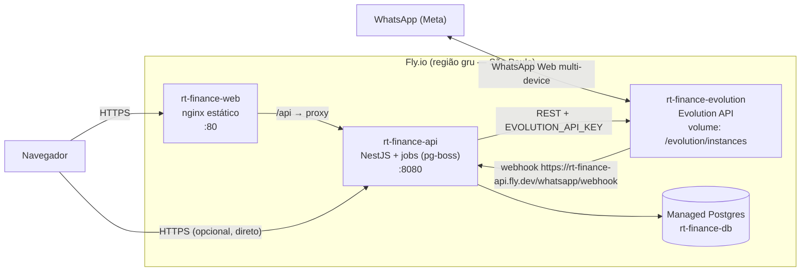

# 05 — Deploy

Duas opções: **VPS + Docker Compose** (implementada — arquivos prontos no repo) ou
**Fly.io** (plano, mais abaixo).

> **Antes de qualquer deploy, leia o [`SECURITY.md`](../SECURITY.md)** e cumpra o
> checklist: rotacionar `NVIDIA_API_KEY` (a de dev foi exposta), segredos JWT fortes,
> `AUTH_COOKIE_SECURE=true` + TLS, `WEB_ORIGIN` real, `trustProxy` no IP do proxy.

---

## 0. VPS + Docker Compose (recomendado para o uso atual)

Serve o painel e a API no mesmo domínio; Postgres e Evolution ficam numa rede
interna. Você coloca um proxy TLS (Caddy/Traefik/nginx do host) na frente.

**Arquivos:** `docker-compose.prod.yml`, `apps/api/Dockerfile`, `apps/web/Dockerfile`,
`apps/web/nginx.conf`, `deploy/init-evolution-db.sql`, `.env.prod.example`.

```bash
# 1. no servidor, com Docker + Docker Compose instalados
git clone <repo> rt-finance && cd rt-finance

# 2. configuração
cp .env.prod.example .env.prod
openssl rand -base64 48   # JWT_ACCESS_SECRET
openssl rand -base64 48   # JWT_REFRESH_SECRET
nano .env.prod            # preencha domínio, senhas, chave NVIDIA nova, etc.

# 3. subir (build + migrate deploy automático no start da API)
docker compose -f docker-compose.prod.yml --env-file .env.prod up -d --build

# 4. criar o 1º household (super-admin). Uma vez só:
docker compose -f docker-compose.prod.yml exec api pnpm --filter @rt-finance/api db:seed
#   -> loga com SEED_OWNER_EMAIL / SEED_OWNER_PASSWORD (ou os do .env)
```

O nginx do painel fica em `WEB_PORT` (default `8088`). Aponte seu proxy TLS:
`https://rtfinance.seudominio.com` → `web:80` (ou `localhost:8088`). Exemplo Caddy:

```
rtfinance.seudominio.com {
    reverse_proxy localhost:8088
}
```

### Multi-casal

- **Criar o 2º casal:** logue como super-admin → menu **Admin** → *Novo household*
  (nome + e-mail/senha do dono; parceiro opcional).
- **WhatsApp de cada casal:** cada dono entra com o próprio login → *Configurações →
  WhatsApp → Conectar* → escaneia o QR com o número **daquele casal**. O sistema
  cria uma instância própria na Evolution (`hh-xxxxxxxx`) e roteia entrada/saída
  por telefone + instância. `WHATSAPP_ALLOWLIST` deve ficar **vazio** (qualquer
  telefone cadastrado num household é aceito).
- A Evolution hospeda N instâncias no mesmo container — nada muda no compose.

### Operação

```bash
docker compose -f docker-compose.prod.yml --env-file .env.prod ps
docker compose -f docker-compose.prod.yml --env-file .env.prod logs -f api
# atualizar depois de um git pull:
docker compose -f docker-compose.prod.yml --env-file .env.prod up -d --build
# backup do banco (agende no cron do host):
docker compose -f docker-compose.prod.yml exec -T postgres pg_dump -U rtfinance rtfinance | gzip > backup-$(date +%F).sql.gz
```

---

## 1. Topologia de produção



| App Fly | Conteúdo | Escala | Volume |
|---|---|---|---|
| `rt-finance-api` | API NestJS + worker de jobs no mesmo processo (ETAPA 6 decide separar) | 1 instância (256–512 MB) | — |
| `rt-finance-web` | build Vite servido por nginx; proxy `/api` → API | 1 instância (shared-cpu-1x, 256 MB) | — |
| `rt-finance-evolution` | Evolution API oficial (imagem Docker deles) | **1 instância fixa** (não escalar; sessão única) | **sim** — `instances/` e store da sessão; sem volume, re-parear QR a cada deploy |
| `rt-finance-db` | Fly Managed Postgres | plano básico | gerenciado |

Alternativa ao `rt-finance-web`: publicar o build em **Cloudflare Pages** e apontar
`VITE_API_URL` para `https://rt-finance-api.fly.dev`. Decisão na ETAPA 3.

---

## 2. Segredos (Fly)

Nunca no repositório. `fly secrets set` por app:

```bash
# rt-finance-api
fly secrets set -a rt-finance-api \
  DATABASE_URL="postgres://...gerado pelo Fly..." \
  JWT_ACCESS_SECRET="$(openssl rand -base64 48)" \
  JWT_REFRESH_SECRET="$(openssl rand -base64 48)" \
  NVIDIA_API_KEY="nvapi-..." \
  NVIDIA_MODEL="<modelo definido na ETAPA 5>" \
  EVOLUTION_BASE_URL="http://rt-finance-evolution.internal:8080" \
  EVOLUTION_API_KEY="$(openssl rand -hex 24)" \
  EVOLUTION_INSTANCE="rtfinance" \
  WHATSAPP_WEBHOOK_TOKEN="$(openssl rand -hex 24)" \
  WHATSAPP_ALLOWLIST="+55XXXXXXXXXXX,+55YYYYYYYYYYY" \
  API_PUBLIC_URL="https://rt-finance-api.fly.dev" \
  WEB_ORIGIN="https://rt-finance-web.fly.dev"

# rt-finance-evolution
fly secrets set -a rt-finance-evolution \
  AUTHENTICATION_API_KEY="<mesmo valor de EVOLUTION_API_KEY acima>" \
  DATABASE_ENABLED="false"   # sessão em arquivo no volume; simples p/ 1 número
```

Comunicação API ↔ Evolution usa a **rede privada** do Fly (`*.internal`), não a
internet pública. O webhook aponta para o hostname público da API (a Evolution precisa
resolver DNS externo mesmo estando no Fly — usar `API_PUBLIC_URL`).

---

## 3. Pipeline de deploy

1. `pnpm install && pnpm build` (Turbo) — valida tipos e build de `shared`, `api`, `web`.
2. `pnpm --filter @rt-finance/api prisma migrate deploy` — aplica migrations pendentes
   (rodar como **release_command** no `api.fly.toml`, antes de trocar as instâncias).
3. `fly deploy -c fly/api.fly.toml`
4. `fly deploy -c fly/web.fly.toml`
5. Evolution: `fly deploy -c fly/evolution.fly.toml` (raro; só em upgrade de versão).

`release_command` no `api.fly.toml`:

```toml
[deploy]
  release_command = "node apps/api/dist/prisma-migrate-deploy.js"  # wrapper de `prisma migrate deploy`
```

Health checks: `GET /health` (API), `GET /` (web).

---

## 4. Primeira configuração da Evolution API

1. Subir `rt-finance-evolution` com o volume montado.
2. Criar a instância: `POST {EVOLUTION_BASE_URL}/instance/create`
   `{ "instanceName": "rtfinance", "integration": "WHATSAPP-BAILEYS" }`
   (header `apikey: EVOLUTION_API_KEY`).
3. Configurar o webhook da instância para
   `https://rt-finance-api.fly.dev/whatsapp/webhook`, evento `MESSAGES_UPSERT`,
   com o header/token `WHATSAPP_WEBHOOK_TOKEN`.
4. Obter o QR code (`GET /instance/connect/rtfinance`) e parear com o WhatsApp do casal
   (aparelho dedicado ou linha secundária — o número **não** deve ser usado no app
   normal simultaneamente sem multi-device).
5. Confirmar `state: open`. O volume mantém a sessão entre restarts.

> Os nomes exatos de rota/campo da Evolution API são verificados na ETAPA 4 contra a
> documentação da versão fixada da imagem — não assumir sem checar.

---

## 5. Desenvolvimento local (`docker-compose.yml`)

```yaml
services:
  postgres:
    image: postgres:16-alpine
    environment:
      POSTGRES_USER: rtfinance
      POSTGRES_PASSWORD: rtfinance
      POSTGRES_DB: rtfinance
    ports: ["5432:5432"]
    volumes: ["pgdata:/var/lib/postgresql/data"]

  evolution:
    image: atendai/evolution-api:v2.x        # versão exata fixada na ETAPA 4
    environment:
      AUTHENTICATION_API_KEY: dev-evolution-key
      DATABASE_ENABLED: "false"
    ports: ["8080:8080"]
    volumes: ["evolution_instances:/evolution/instances"]

volumes:
  pgdata:
  evolution_instances:
```

Fluxo local: `docker compose up -d` → `prisma migrate dev` → `prisma db seed` →
`pnpm dev`. Para testar o webhook sem expor a máquina, usar um túnel
(`cloudflared tunnel` ou similar) apontando para `http://localhost:3333`.

---

## 6. Backups

- Job `backup.job.ts` (pg-boss, cron `BACKUP_CRON`): `pg_dump` → objeto comprimido em
  storage (Fly Volumes / S3-compatível / Backblaze B2), retenção `BACKUP_RETENTION_DAYS`.
- Somado aos snapshots automáticos do Managed Postgres do Fly.
- Restore documentado: `pg_restore` num banco limpo + `prisma migrate deploy`.

---

## 7. Checklist de produção (ETAPA 7)

- [ ] `env.schema.ts` falha o boot se faltar segredo obrigatório.
- [ ] Rate limit no webhook e em `/auth/*`.
- [ ] `AUTH_COOKIE_SECURE=true`, `SameSite=Lax`, domínio correto.
- [ ] CORS restrito a `WEB_ORIGIN`.
- [ ] Logs sem PII sensível (mascarar telefone/valores em nível `info`).
- [ ] `release_command` roda migrations antes do cutover.
- [ ] Volume da Evolution com snapshot.
- [ ] Sentry (ou equivalente) ligado com `SENTRY_DSN`.
- [ ] Alerta de erro no job de fechamento de fatura (crítico).
